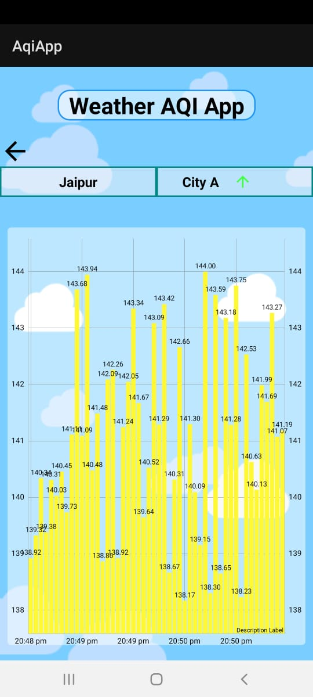
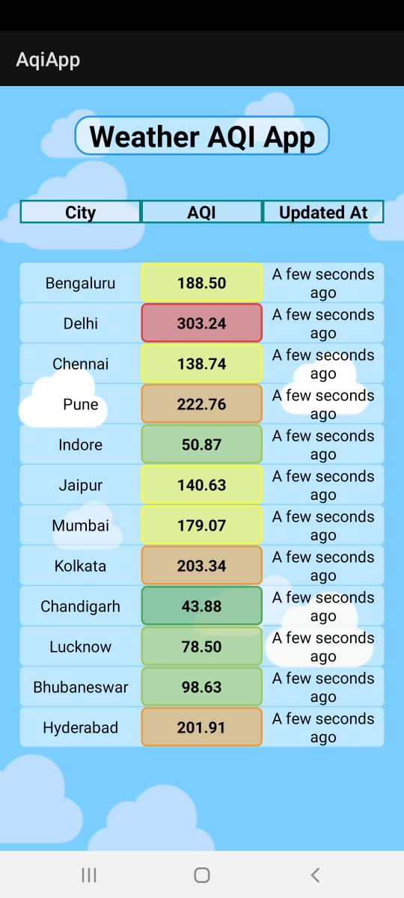

# WeatherAQIApp
Its an waether aqi app which live updates of air quality index citiwise to the user.
.When user click on a city ,it will show previous aqis in graph form.
Apk file is Available.
App uses WebSocket to communicate with Server
WS URL : wss://city-ws.herokuapp.com/

## Screenshots

   
  
  
   

## Features
This app shows you the following data :
- See AQI data of Indian Cities relatime updates
- Lets user See Previous AQI data of Cities in the form of graph.

## Architecture
- App uses MVVM architecture Its a Single Activity based Application.
- MVVM helps in sharing data among Fragments.
- LiveData is used in order to prevent any Memory Leaks and getting the live updates.
- Activities and Fragment uses View bindings.
- It uses Mutable Lists,HashMaps for calculation of Some Recorded data.
- Socket Stream Data gets Stored into a List on which upcoming data is overriden with the help of IndexHashMap
- and Data gets Accumulated into FixedSize queue for Previous History related Data.
- Time of AQI is considered to be the time AQI was fetched.
- have used Recyclerview,androidx and viewmodel mainly.

## Time Spent on Each Module
- Base Project setup : 1 hour
- UI Animations,Icons Assets etc : 1 Hour
- MVVM Setup : 2 Hour
- Graph library setup- 1 hour
- Bugs and Debugging  : 1 Hour

