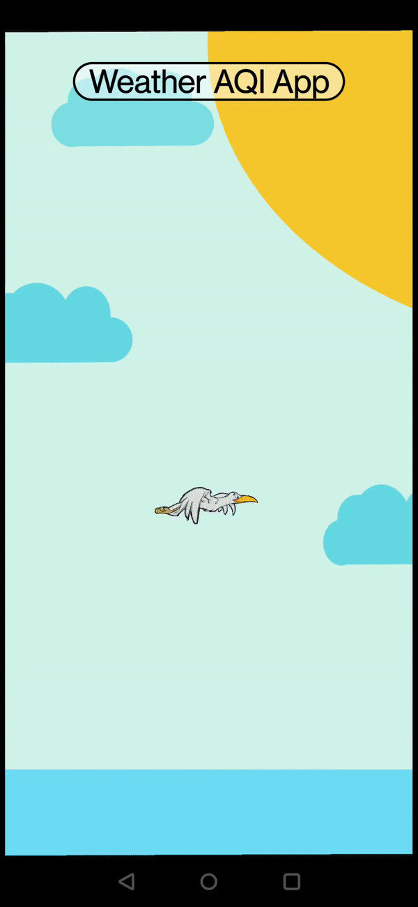
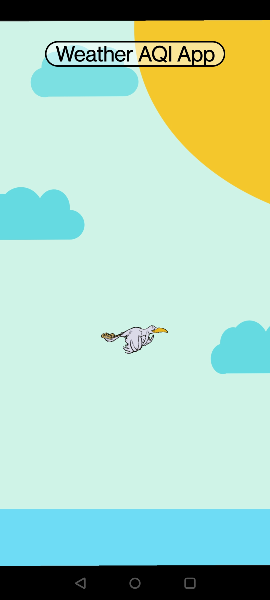
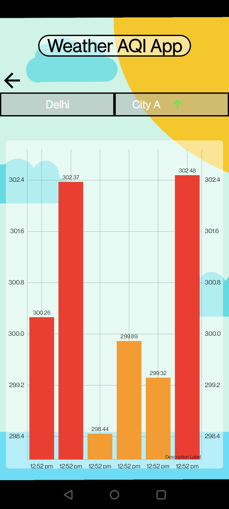
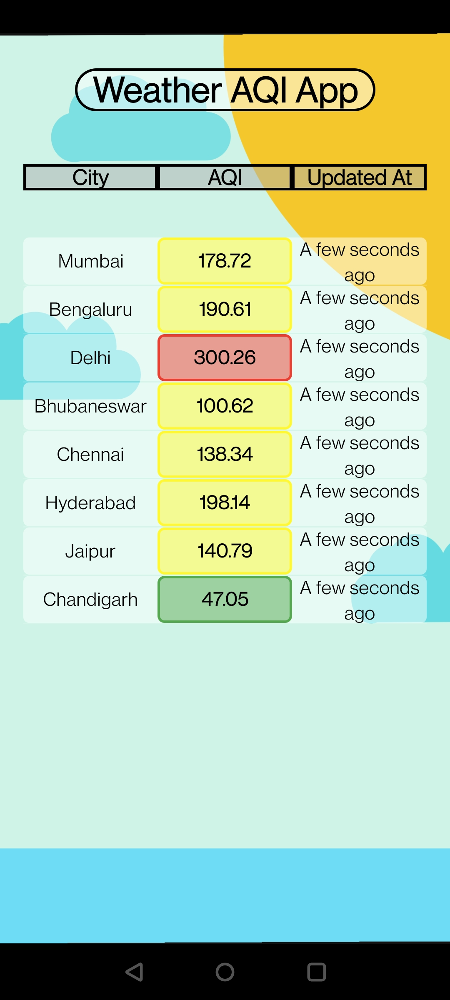

# WeatherAQIApp
Its a Weather AQI app that lets user see the AQI indexes of Multiple Indian Cities and
also Shows DataVisualization of graph showing Previous AQI indices.
Apk file is Available [here]("AQI App.apk").
App uses WebSocket to communicate with Server
WS URL : wss://city-ws.herokuapp.com/

## Screenshots

## Features
This app lets you :
- See AQI data of Indian Cities in Realtime.
- Lets user See Previous AQI data of Cities.

## Architecture
- App uses MVVM architecture Its a Single Activity based Application.
- MVVM helps in sharing data among Fragments.
- LiveData is used in order to prevent any Memory Leaks.
- Activities and Fragment uses View bindings.
- It uses Mutable Lists,FixedSize Queue,HashMaps for calculation of Some Recorded data.
- Socket Stream Data gets Stored into a List on which upcoming data is overriden with the help of IndexHashMap
- and Data gets Accumulated into FixedSize queue for Previous History related Data.
- Time of AQI is considered to be the time AQI was fetched.

## Time Spent on Each Module
- Socket Setup : 1 hour
- UI Animations,Icons Assets etc : 2 Hour
- MVVM Setup : 1 Hour
- Graph Library Setup : 2 Hour
- Bugs and Debugging : 1 Hour

